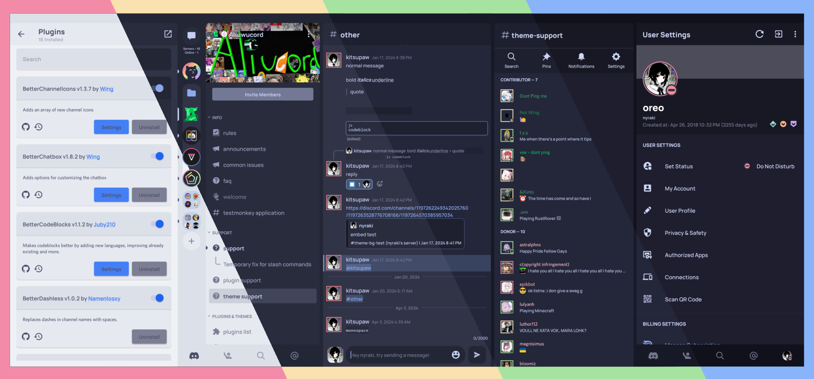
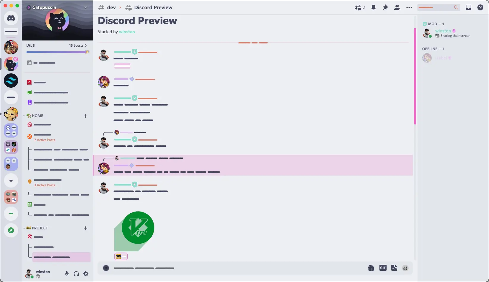

<h3 align="center">
	 
	
	Catppuccin for <a href="https://github.com/Aliucord/Aliucord">Aliucord</a>
	
</h3>

    
    
    

  

## Previews

🌻 Latte

🪴 Frappé

🌺 Macchiato

🌿 Mocha

## Usage

### Method 1 (Downloading the File Directly)
1. Download the desired flavour of choice!
2. Move the theme to Aliucord's themes directory: `sdcard/Aliucord/themes`
3. Open Themer plugin settings.
4. Enable the theme!

### Method 2 (Via the App itself)
1. Join the [Aliucord Server](https://discord.com/invite/EsNDvBaHVU)
2. Click on this [link](https://discord.com/channels/811255666990907402/824357609778708580/1020200793338548304)
> [!NOTE]
> This link currently does not work, as the theme has not been submitted.
3. Long press the message and press on install then tap on your desired flavour!
4. Open Aliucord's settings
5. Open Themer's plugin settings
6. Enable the theme!

## 🙋 FAQ 

> [!CAUTION]
> **Using third party clients is against the ToS. We are not responsible for anything that might happen to your account by using third party clients. Use at your own discretion.**

- Q: **_Which plugins are used in the screenshots?_**

  A: The plugins included are:
  	- BetterChatbox
  	- BetterStatusIndicators
  	- BetterChannelIcons
  	- BetterDashless
  	- NoBurnIn
  	- LayoutController
  	- SquareAvatars

- Q: **_Why can't I see X thing themed?_** 
  
  A: The introduction of Material You has affected devices on Android 12+, and some areas may not render correctly. If you are on a Custom ROM, please look at [this fix.](https://rentry.co/ThemerFixer)

## 💝 Thanks to:

- [Skinatro](https://github.com/skinatro)
- [lemon](https://github.com/andreasgrafen)
- [Isabelinc](https://github.com/Isabelincorp)
- [WitherCubes](https://github.com/WitherCubes) 
- [myumichi](https://github.com/myumichi)  
and everyone else who made the original Discord PC and Aliucord port!
&nbsp;

Copyright &copy; 2021-present <a href="https://github.com/catppuccin" target="_blank">Catppuccin Org</a>

