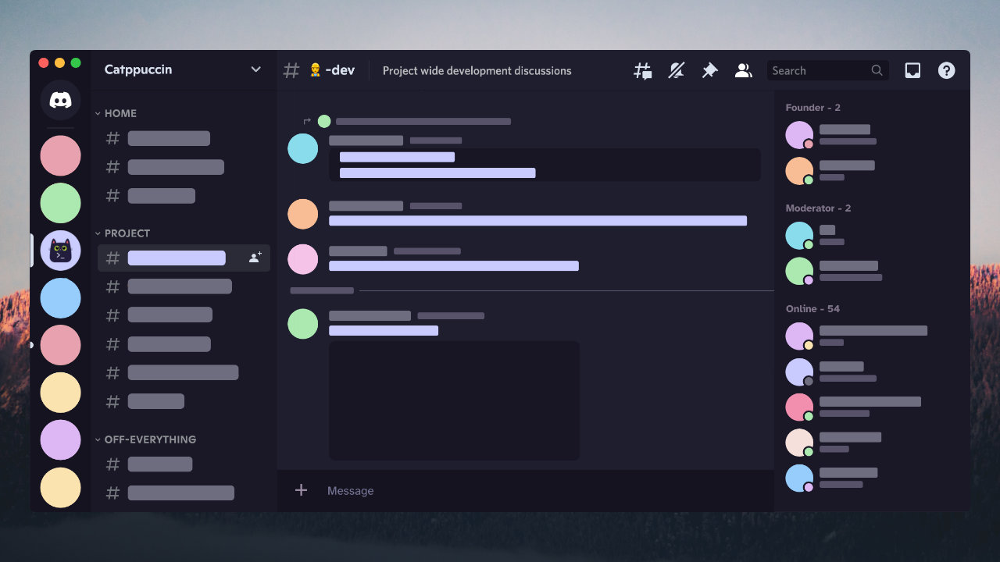

<h3 align="center">
	<br/>
	
	Catppuccin for <a href="https://discord.com/">Discord</a>
	
</h3>

<p align="center">
    <a href="https://github.com/catppuccin/discord/stargazers"></a>
    <a href="https://github.com/catppuccin/discord/issues"></a>
    <a href="https://github.com/catppuccin/discord/contributors"></a>
</p>



## Usage


### [BetterDiscord](https://betterdiscord.app) / [GooseMod](https://goosemod.com/)

1. Download your preferred flavour:

- 🌻 [Latte](https://github.com/catppuccin/discord/raw/main/dist/catppuccin-latte.theme.css)
- 🪴 [Frappe](https://github.com/catppuccin/discord/raw/main/dist/catppuccin-frappe.theme.css)
- 🌺 [Macchiato](https://github.com/catppuccin/discord/raw/main/dist/catppuccin-macchiato.theme.css)
- 🌿 [Mocha](https://github.com/catppuccin/discord/raw/main/dist/catppuccin-mocha.theme.css)

2. BetterDiscord: 
	1. Copy the downloaded file to your BetterDiscord themes folder.
	2. Enable the theme in BetterDiscord settings.
3. GooseMod:
	1. Copy the CSS into your clipboard
	2. Open Discord > Settings > Custom CSS and paste it in there.

### [DiscoCSS](https://github.com/mlvzk/discocss)

1. Follow the instructions from [DiscoCSS](https://github.com/mlvzk/discocss#installation) to install DiscoCSS.
2. Use your preferred flavour as your DiscoCSS `custom.css`
```bash
# latte
curl -L https://github.com/catppuccin/discord/blob/main/dist/catppuccin-latte.theme.css >> ~/.config/discocss/custom.css
# frappe
curl -L https://github.com/catppuccin/discord/blob/main/dist/catppuccin-frappe.theme.css >> ~/.config/discocss/custom.css
# macchiato
curl -L https://github.com/catppuccin/discord/blob/main/dist/catppuccin-macchiato.theme.css >> ~/.config/discocss/custom.css
# mocha
curl -L https://github.com/catppuccin/discord/blob/main/dist/catppuccin-mocha.theme.css >> ~/.config/discocss/custom.css
```

2. Use the documentation and find out how to inject the css file and use the theme.

### [Stylus](https://github.com/openstyles/stylus)

1. Download the [`discord.user.css`](./discord.user.css)
2. Choose your preferred flavour and options from the Stylus preference dropdown.

## 🙋 FAQ

-   Q: **_"Can this get my account banned?"_**
-   A: Using third party clients and injecting custom css is against the ToS. We are not responsible for anything that might happen to your account by using third party clients. Use at your own discretion!

## 💝 Thanks to

-   [DonutDev](https://github.com/DonutDev)
-   [Hanno van Baarle](https://github.com/HannoVB1)
-   [Andreas Grafen](https://github.com/andreasgrafen)
-   [Sanjay Pavan](https://github.com/WitherCubes)
-   [Tuhana GAYRETLİ](https://github.com/tuhanayim)
-   [GlowingUmbreon](https://github.com/glowingumbreon)
-   [winston](https://github.com/nekowinston)

&nbsp;

<p align="center"></p>
<p align="center">Copyright &copy; 2021-present <a href="https://github.com/catppuccin" target="_blank">Catppuccin Org</a>
<p align="center"><a href="https://github.com/catppuccin/catppuccin/blob/main/LICENSE"></a></p>
